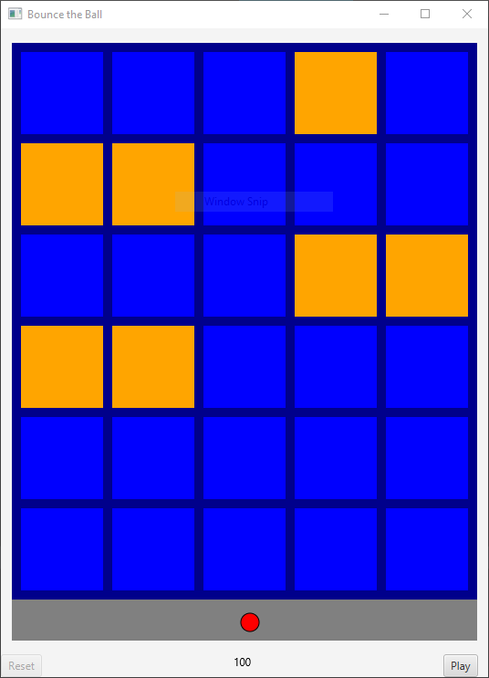
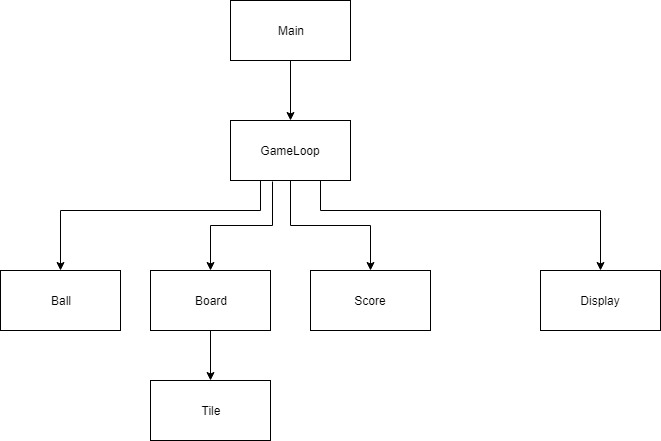

# PinBall
by Gavin McGuire
for UNM CS351

## How to play

* Click on jar file to start game.
  

* You can move the ball around by just moving in on the window.
* Clink on the window or "play" / launch the ball.
* Click "reset" button to reset ball, board, and score.

## Development

* Tested and debugged in intellij
* Simple GameLoop structure
    - `Board` organizes `Tiles` that light up to indicate targets.
    - `Ball` is controlled and set in play.
      - Tracks position
      - Tracks misses
    - `Score` is updated according to ball hits and misses.
    - `Display` javafx draws all the components.

